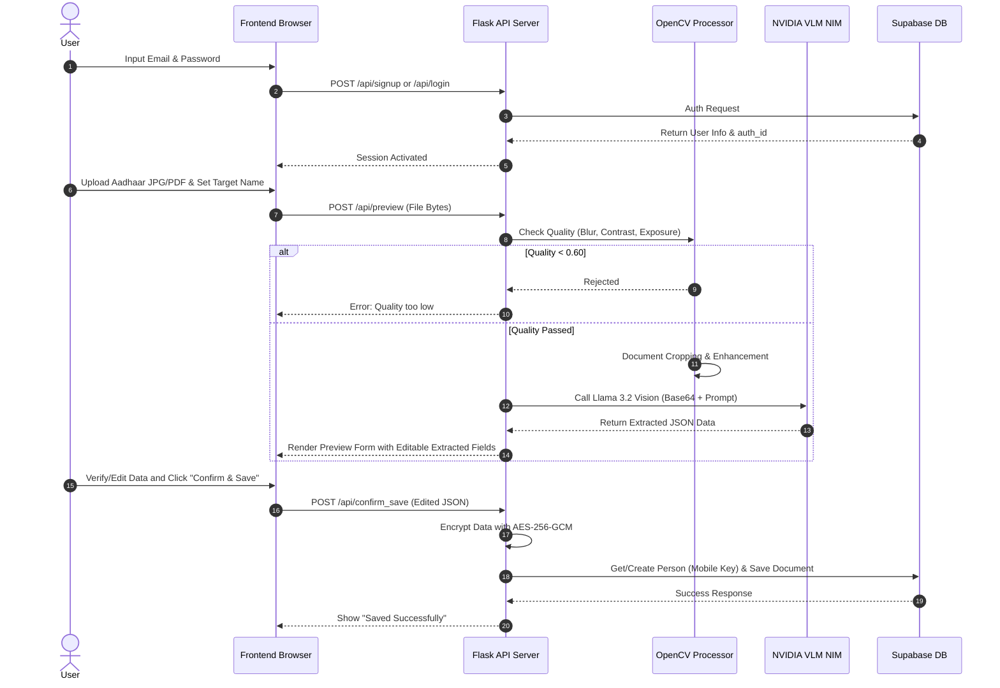

# PAN / Aadhaar Document Verification Agent - Documentation

This document provides a detailed overview of the features, architecture, data flow, and file structure of the **Updated Document Upload & Verification Agent** located in `updated_document_upload_agent`.

---

## 🚀 Overview

The **PAN / Aadhaar Document Verification Agent** is a secure, automated document processing system designed to extract details from Indian government identity cards (primarily Aadhaar) and verify application assets (passport photos and signatures) for PAN card applications.

The application leverages a Flask-based backend, a vanilla HTML/JS frontend, OpenCV-based image processing, cryptographic security (AES-256-GCM), and Vision-Language Models (VLM) via NVIDIA NIM APIs (Meta Llama 3.2 90B Vision Instruct).

---

## 🛠️ Key Features

### 1. 🔐 User Authentication (Supabase Auth)
- Built-in user sign-up (`/api/signup`) and sign-in (`/api/login`) integrations using the Supabase Python SDK.
- Restricts document upload, retrieval, and updates to authenticated sessions via an `auth_id`.

### 2. 👁️ Image Quality & Technical Validation
- **Instant Pre-processing**: Uses OpenCV to evaluate document suitability without sending images to the cloud first.
- **Blur Check**: Computes Laplacian variance to reject blurry images (threshold: $> 100$).
- **Brightness & Exposure Checks**: Calculates mean grayscale pixel intensity to detect extremely dark ($<40$) or overexposed ($>240$) uploads.
- **Resolution Verification**: Restricts uploads to a minimum size/resolution ($150\times150$ px, between 20KB and 10MB).
- **Document Cropping & Enhancement**: Uses OpenCV edge detection (`cv2.Canny`) and contour finding (`cv2.findContours`) to crop to the document boundary, followed by CLAHE contrast enhancement.

### 3. 🧠 AI-powered VLM Extraction (NVIDIA NIM VLM)
- Uses **Meta Llama 3.2 90B Vision Instruct** to extract highly structured JSON fields from document images.
- Extracts Aadhaar details including:
  - Aadhaar number (automatically tracks if it's a masked version).
  - Full Name, First Name, Last Name, Middle Name.
  - Father's/Guardian's Name parts (derived from C/O, S/O, D/O, W/O lines).
  - Date of Birth (DOB) and Gender.
  - Contact Details (Mobile Number, Email).
  - Complete Address Components (Flat, Post Office, City/VTC, District, State, Pincode).
- Returns extraction confidence levels (`high`, `medium`, or `low`).

### 4. 🔒 Data Privacy & Encryption (AES-256-GCM)
- High-security processing handles Personal Identifiable Information (PII) safely.
- All extracted document metadata is encrypted before database insertion using **AES-256-GCM** (provided via Python's `cryptography` AEAD package).
- Decrypted dynamically on fetch requests only for authorized users.

### 5. 🗃️ Person & Document Management
- Organizes documents around a unique **Person** concept.
- Integrates multi-parameter lookup logic allowing search and updates of records by either **Name** OR **Phone Number (Mobile)** (backed by database indices).
- Automatically manages old files (deletes legacy records when updating a person's document).

### 6. 🛡️ Verification Standards
- **Aadhaar Validation**: Validates Aadhaar format (12 digits, optional masking) and 6-digit postal pincodes.
- **Passport Photo Analysis**: Strictly checks for:
  - Face existence and face count (rejects multiple faces).
  - Centered faces, open eyes, color vs. black-and-white, and sunglasses detection.
  - Plain white/light background validation.
- **Signature Analysis**: Checks if a signature is hand-drawn (not typed), clearly visible (not too faint), on a clean light background, and not cut off at the image borders.

---

## 📁 Component Directory & Files

| File/Folder | Purpose |
| :--- | :--- |
| **[app.py](file:///e:/PAN_APP/updated_document_upload_agent/app.py)** | Main Flask web server hosting endpoints for auth, upload, preview, verification, and database search. |
| **[helpers.py](file:///e:/PAN_APP/updated_document_upload_agent/helpers.py)** | Engine wrapper around the NVIDIA NIM API. Converts PDF files using `pdf2image` and transforms bytes/images into Base64 payloads for the VLM prompts. |
| **[pan_verification_upd.py](file:///e:/PAN_APP/updated_document_upload_agent/pan_verification_upd.py)** | Complete asynchronous multi-document verification pipeline (parallelized via `asyncio.gather`). Offers a CLI interface for verifying application documents. |
| **[supa.py](file:///e:/PAN_APP/updated_document_upload_agent/supa.py)** | Interface to Supabase PostgreSQL database. Deals with creating persons, inserting encrypted document logs, and retrieving records. |
| **[crypto_utils.py](file:///e:/PAN_APP/updated_document_upload_agent/crypto_utils.py)** | Symmetric key encryption utility utilizing AES-256-GCM with base64 serialization. |
| **[image_quality.py](file:///e:/PAN_APP/updated_document_upload_agent/image_quality.py)** | Offline computer vision functions for checks (brightness, blur, cropping, contrast enhancements). |
| **[re_check.py](file:///e:/PAN_APP/updated_document_upload_agent/re_check.py)** | Regex checks and age calculations verifying DOB and document structure consistency. |
| **[templates/index.html](file:///e:/PAN_APP/updated_document_upload_agent/templates/index.html)** | Single-page UI offering Interactive Login, Signup, View, Update, Preview-consent draft flows. |

---

## 🔄 End-to-End Processing Flow

